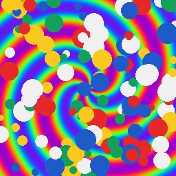
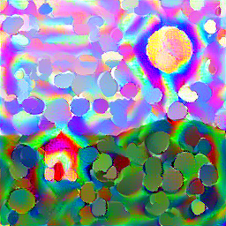
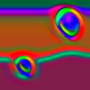
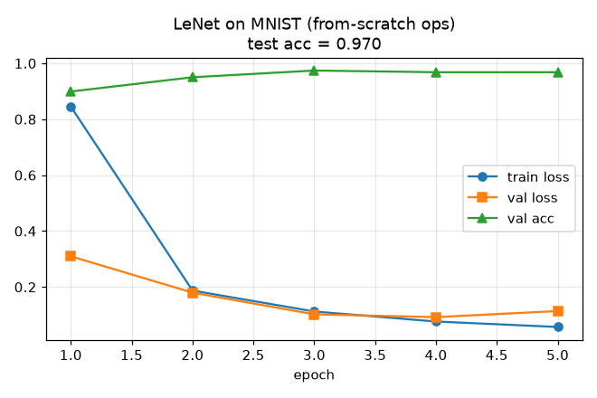

# AICS Labs — 智能计算系统 (AI Computing Systems)

> Operators, a small deep-learning framework, and an image style-transfer application
> built up **from scratch** — an independent, from-scratch implementation of
> **智能计算系统 (AI Computing Systems)** by Chen Yunji (陈云霁) et al. (ICT/UCAS), part of a
> [csdiy.wiki](https://csdiy.wiki/机器学习系统/AICS/) full-catalog build.


## Overview

The *AI Computing Systems* course labs build up, layer by layer, toward a single
driving application: **neural image style transfer**. You implement the core
operators of a deep-learning framework (convolution, pooling, activations,
fully-connected, softmax + cross-entropy), assemble them into a working framework
with forward + backward passes, and then build both **non-real-time**
(optimization-based) and **real-time** (feed-forward) style transfer on top of a
VGG19 feature extractor, culminating in a full end-to-end style-transfer app.

This repository reimplements that arc:

1. **Operators from scratch (numpy)** — every operator with a hand-derived
   backward pass, verified by finite-difference gradient checks.
2. **A mini deep-learning framework** — a `Sequential` container, SGD (+momentum,
   weight decay), and a training loop; used to train a **LeNet built entirely
   from our own operators** on MNIST.
3. **Style transfer** — VGG19 features + Gram matrices, the Gatys
   optimization-based method, and the Johnson feed-forward real-time method.
4. **The capstone application** — one CLI that stylises any content image with any
   style image via either method.

### Deviation from the original labs (documented partial)

The original AICS labs target the **DLP / Cambricon** simulator and its toolchain
(`pycnml`, the **BCL** intelligent-programming language, and the DLP arithmetic-unit
RTL in chapters 5–6). That hardware/simulator toolchain is **not available on this
machine** (Windows, CPU-only, no Cambricon SDK, WSL broken). Per the project's
"documented partial" rule, the **equivalent operators, framework, and style-transfer
application** are implemented in **numpy / PyTorch on CPU**, which exercises exactly
the same concepts (im2col convolution, pooling, backprop, Gram-matrix style loss,
perceptual loss, feed-forward stylisation). The BCL / DLP-RTL hardware chapters
(5.2 low-level BCL kernel optimization, 6.x arithmetic-unit Verilog) are the parts
that genuinely require the Cambricon stack and are **not reproduced**; everything
they teach at the algorithm/operator level *is* implemented here in numpy.

## Results (measured on CPU, `OMP_NUM_THREADS=3`)

| Lab (equiv.) | What it does | Result (measured) |
|---|---|---|
| Operators (2/3.1) | conv/pool/act/linear/softmax-CE, forward+backward | **10/10 gradient checks pass** (rel. err < 1e-5) |
| Framework (2/4) | LeNet from our own ops, trained on MNIST | **test accuracy 0.970** (2000 held-out digits, 5 epochs) |
| Non-real-time ST (3.3) | Gatys LBFGS style transfer, VGG19, 256px | total loss **12777 → 68** over 300 steps (~16 min) |
| Real-time ST (4.2/4.3) | Johnson feed-forward net, VGG19 perceptual loss, 128px | style loss **4184 → 1259** (120 steps, ~6 min train); **single-image stylisation = 242 ms / image** (one forward pass) |
| Capstone (7) | full `stylize_app.py` CLI (gatys \| realtime) | produces real stylised images (see `results/`) |

The real-time net stylises in **~0.24 s/image** after training, versus **~16 min/image**
for the Gatys optimisation method — the whole point of the feed-forward approach.

**Non-real-time style transfer output** (content structure preserved, style
texture transferred):

| Content | Style | Stylised (Gatys) | Stylised (real-time net) |
|---|---|---|---|
|  |  |  |  |

**From-scratch LeNet on MNIST** (trained with our numpy operators + framework):



All numbers above are produced by the scripts below and saved under `results/`
(`gatys_meta.json`, `realtime_meta.json`, `mnist_cnn_history.json`).

## Implemented assignments

- [x] **Operators (Lab 2 / 3.1 equiv.)** — `Conv2D` (im2col), `MaxPool2D`,
  `AvgPool2D`, `ReLU`/`Sigmoid`/`Tanh`, `Linear`, softmax + cross-entropy, each
  with a hand-written backward pass.
- [x] **Deep-learning framework (Lab 2 / 4 equiv.)** — `Sequential`, `Flatten`,
  `SGD` (momentum + weight decay), training loop; trains a from-scratch LeNet on MNIST.
- [x] **VGG19 feature extractor + Gram matrices** — content/style representations.
- [x] **Non-real-time style transfer (Lab 3.3 equiv.)** — Gatys optimization-based
  method (LBFGS), content + style + TV loss.
- [x] **Real-time style transfer (Lab 4.2/4.3 equiv.)** — Johnson feed-forward
  `TransformNet` (residual + instance-norm + upsample-conv), trained with the VGG19
  perceptual loss; stylisation is a single forward pass.
- [x] **Capstone application (Lab 7 equiv.)** — `scripts/stylize_app.py`, one CLI for
  both methods on arbitrary content/style images.
- [ ] **BCL kernel optimization (Lab 5.2) & DLP arithmetic-unit RTL (Lab 6.x)** —
  not reproduced (require the Cambricon/DLP hardware toolchain; see *Deviation* above).

## Project structure

```
aics-labs/
├── aics/
│   ├── operators/        # from-scratch numpy ops (conv im2col, pool, act, linear, losses)
│   ├── framework/        # Sequential, SGD, trainer (mini DL framework)
│   └── style_transfer/   # VGG19 features, Gatys, TransformNet, real-time train/infer
├── scripts/              # download_mnist, train_mnist_cnn, run_gatys, train_realtime, stylize_app
├── tests/                # gradient checks + style-transfer unit tests
├── results/              # measured outputs, figures, stylised images (committed as evidence)
└── requirements.txt
```

## How to run

```bash
# Python 3.11. Shared csdiy env: D:\Project\_csdiy\.venv-ml\Scripts\python.exe
python -m pip install -r requirements.txt
export OMP_NUM_THREADS=3   # CPU-only

# 1) Verify all operators via gradient checks + style-transfer unit tests
python -m pytest -v

# 2) Train the from-scratch LeNet on MNIST (downloads MNIST at runtime)
python scripts/train_mnist_cnn.py

# 3) Non-real-time (Gatys) style transfer -> results/gatys_stylized.png
python scripts/run_gatys.py --size 256 --steps 300

# 4) Real-time (feed-forward) style transfer: train then one-pass stylise
python scripts/train_realtime.py --steps 200 --size 256

# 5) Capstone app — stylise any content with any style, either method
python scripts/stylize_app.py --content data/content.jpg --style data/style.jpg \
    --method gatys --steps 300 --out results/app_gatys.png
```

Drop your own `content.jpg` / `style.jpg` into `data/` to restyle real photos; the
default example images are generated procedurally (no copyrighted assets committed).

## Verification

- **Operators:** `tests/test_operators.py` runs central-difference gradient checks
  against every analytic backward pass — 10 tests, all passing (relative error
  < 1e-5), plus a naive-loop cross-check of the conv forward.
- **Framework:** `scripts/train_mnist_cnn.py` trains a LeNet made **only of our own
  operators** and reaches **0.970 test accuracy** on MNIST — proving the ops compose
  into a correct, trainable network (evidence: `results/mnist_cnn_history.json`,
  `results/mnist_cnn_curve.png`).
- **Style transfer:** `scripts/run_gatys.py` produces a real stylised image with the
  style loss driven down by ~180× (`results/gatys_stylized.png`,
  `results/gatys_meta.json`); `tests/test_style_transfer.py` checks the Gram matrix,
  `TransformNet` shape/differentiability, and image normalisation round-trip.

## Tech stack

Python 3.11 · numpy (from-scratch operators + framework) · PyTorch 2.x CPU +
torchvision (VGG19 extractor, autograd for the style-transfer optimisation) ·
Pillow · matplotlib · pytest.

## Key ideas / what I learned

- **im2col convolution** turns conv into a single matrix multiply; the backward pass
  is a `col2im` scatter-add — deriving both by hand makes the framework internals concrete.
- A correct operator library is *verifiable*: finite-difference gradient checks catch
  any backward-pass bug immediately.
- **Style = second-order feature statistics.** The Gram matrix of VGG features captures
  texture/style independent of spatial layout; matching Grams transfers style.
- **Non-real-time vs real-time** is an optimise-the-image vs amortise-into-a-network
  trade-off: Gatys optimises pixels per image (slow, flexible); Johnson trains a
  feed-forward net once, then stylises in a single pass.
- Perceptual (feature-space) losses beat pixel losses for generation because they
  compare *what the image contains*, not raw RGB.

## Credits & license

Based on the labs of **智能计算系统 / AI Computing Systems** by **Chen Yunji (陈云霁)**
and team (ICT, Chinese Academy of Sciences / UCAS). This repository is an independent
educational reimplementation; all course materials, datasets, and specifications
belong to their original authors. The DLP/Cambricon-specific hardware labs are not
reproduced (see *Deviation*). Original code in this repo is released under the
[MIT License](LICENSE).
